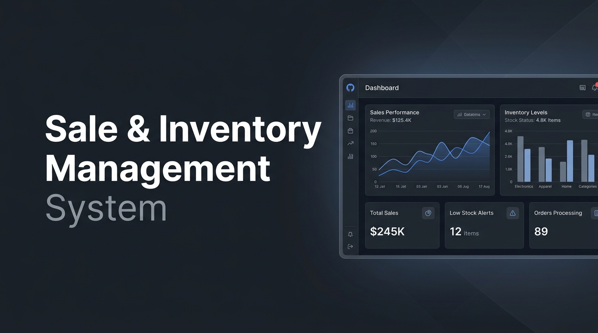
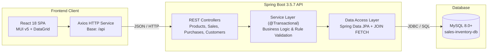

# Sale & Inventory Management System

[](https://www.oracle.com/java/)
[](https://spring.io/projects/spring-boot)
[](https://reactjs.org/)
[](https://mui.com/)
[](https://www.mysql.com/)
[](LICENSE)

> A full-stack inventory and point-of-sale management system engineered with Spring Boot 3, React 18, and Material-UI featuring atomic transaction synchronization, low-stock threshold alerting, and customer lifetime analytics.

## Visuals & Demonstration

<p align="center">
  
</p>

---

## Overview & Motivation

Small-to-medium retail and distribution businesses face significant operational friction due to inventory shrinkage, uncoordinated supplier restocking, and out-of-stock delays during checkout. 

This project delivers an **enterprise-grade, ACID-compliant Sale and Inventory Management Platform** designed to:
1. **Eliminate Race Conditions:** Ensure atomic inventory deductions upon sale confirmation and automated stock increments upon purchase receipt within database transaction boundaries.
2. **Enforce Domain Constraints:** Prevent invalid orders against blocked customer accounts, inactive suppliers, or depleted inventory levels.
3. **Proactively Flag Stock Deficits:** Monitor live stock against safety thresholds via dynamic deficit calculation algorithms.
4. **Deliver Actionable Customer Insights:** Aggregate customer order histories, volume statistics, and lifetime value in dedicated analytics views.

---

## Key Features

- **Real-Time Stock Inventory:** Live tabular inventory dashboard with search, category filtering, and safety-stock threshold badges.
- **Outbound Sales Processing:** Point-of-sale checkout with real-time inventory validation, quantity checks, custom price override support, and blocked account enforcement.
- **Inbound Purchase Replenishment:** Supplier procurement logging with automatic stock increments and financial expenditure totals.
- **Customer Analytics Dashboard:** Comprehensive customer profile history displaying order status (`CONFIRMED`, `CANCELLED`), revenue metrics, and account restriction controls.
- **Safety Stock Deficit Alerts:** Backend API (`/api/products/low-stock`) and UI alerts for products below minimum operating thresholds.
- **Optimized Data Retrieval:** Zero N+1 query overhead through custom JPQL `JOIN FETCH` repository methods.
- **Centralized Error Handling:** Standardized error response models, field-level bean validation messages, and custom domain exceptions (`ProductNotFoundException`, `SaleNotFoundException`, `PurchaseNotFoundException`, `BusinessRuleViolationException`).
- **Automated Seed Data Pipeline:** Auto-generates initial catalog, customer, vendor, and transaction records on first startup.

---

## Tech Stack

### Backend
- **Language & Runtime:** Java 17 LTS
- **Framework:** Spring Boot 3.5.7 (Spring Web MVC, Spring Data JPA, Spring Security)
- **Database Persistence:** Hibernate 6 / MySQL 8.0+
- **Validation & Utility:** Jakarta Validation (Bean Validation), Project Lombok
- **Testing:** JUnit 5, Mockito, AssertJ
- **Build Tool:** Apache Maven (Wrapper included)

### Frontend
- **Library & Runtime:** React 18.2.0, JavaScript (ES6+)
- **Routing:** React Router v6.20.0
- **UI Framework & Design System:** Material-UI (MUI v5.18.0), `@mui/x-data-grid` (v6.20.4)
- **HTTP Client:** Axios (v1.6.2)
- **Styling:** Custom responsive theme engine (`theme.js`)

---

## System Architecture

The application adopts a clean, multi-tier decoupled client-server architecture:



For complete architectural diagrams, ER schemas, and component interactions, consult [**`docs/architecture.md`**](docs/architecture.md).

---

## Installation & Quickstart

### Prerequisites
- **Java JDK 17+** (`java -version`)
- **Node.js 18+ LTS** and **npm** (`node -v`, `npm -v`)
- **MySQL Server 8.0+** running on `localhost:3306`

### 1. Database Initialization
Create the database schema in your MySQL instance:
```sql
CREATE DATABASE IF NOT EXISTS `sales-inventory-db` CHARACTER SET utf8mb4 COLLATE utf8mb4_unicode_ci;
```

### 2. Backend Setup
```bash
# Navigate to backend directory
cd server

# Run the Spring Boot application (Maven Wrapper)
# Linux / macOS:
./mvnw clean spring-boot:run

# Windows (PowerShell):
.\mvnw.cmd clean spring-boot:run
```
*The API will start at:* `http://localhost:8080` (Seed data will auto-load on first boot).

### 3. Frontend Setup
```bash
# Navigate to frontend directory
cd client

# Install NPM dependencies
npm install

# Start development server
npm start
```
*The web client will launch at:* `http://localhost:3000`

---

## Usage Guide

1. **Viewing & Searching Products:** Navigate to `/products` to inspect current inventory levels, prices, and low-stock alerts. Use the search bar for instant keyword filtering.
2. **Recording a Sale:** Click **Sell** on any active product row, select an active customer, specify quantity, and confirm order creation. Stock will decrease immediately.
3. **Restocking via Purchase:** Click **Buy** on any product, choose a registered supplier, specify quantity and unit cost. Inventory will increment immediately.
4. **Customer Sales Dashboard:** Navigate to `/dashboard`, select a customer from the dropdown to view historical purchases, filter by status (`CONFIRMED` vs `CANCELLED`), and evaluate total revenue generated.

---

## Running Automated Tests

```bash
# Backend unit & service tests
cd server
./mvnw test

# Frontend component & smoke tests
cd client
npm test -- --watchAll=false
```

---

## Project Documentation

Explore the complete technical documentation suite in the [**`docs/` directory**](docs/README.md):

- [**System Architecture & ER Diagrams**](docs/architecture.md) — Multi-tier architecture, C4 models, ER diagrams, and sequence flows.
- [**REST API Reference**](docs/api.md) — Comprehensive endpoint specifications, request/response payloads, and error models.
- [**Architectural Decision Records (ADRs)**](docs/decisions.md) — Foundational technical decisions and architectural tradeoffs.
- [**Installation & Setup Guide**](docs/setup.md) — Step-by-step local development setup, database provisioning, and troubleshooting.
- [**User & Operations Guide**](docs/usage.md) — Point-of-Sale workflows, restocking operations, and customer analytics.
- [**Developer & Contribution Guide**](docs/development.md) — Coding conventions, layer design patterns, and test execution.
- [**Contributing Guidelines**](CONTRIBUTING.md) — Branch naming standards, Conventional Commits, and PR requirements.
- [**Changelog**](CHANGELOG.md) — Semantic version release notes.

---

## Roadmap

- [x] Spring Boot 3 & React 18 multi-tier architecture
- [x] Atomic transactional stock adjustments (`@Transactional`)
- [x] Low-stock threshold detection and deficit computation
- [x] Customer sales analytics dashboard
- [x] Centralized validation and domain exception handling
- [ ] JWT-based role authentication (Admin / Cashier / Inventory Manager)
- [ ] CSV / PDF export for financial transaction ledgers
- [ ] Barcode / QR scanner integration for rapid point-of-sale checkout

---

## License

This project is open-source and licensed under the [MIT License](LICENSE).  
Developed by **[Saad Mughal](https://github.com/sedmugen)**.
