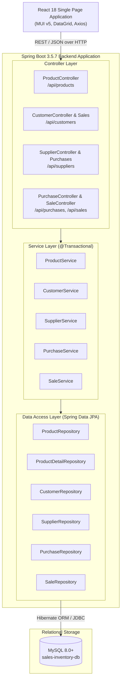
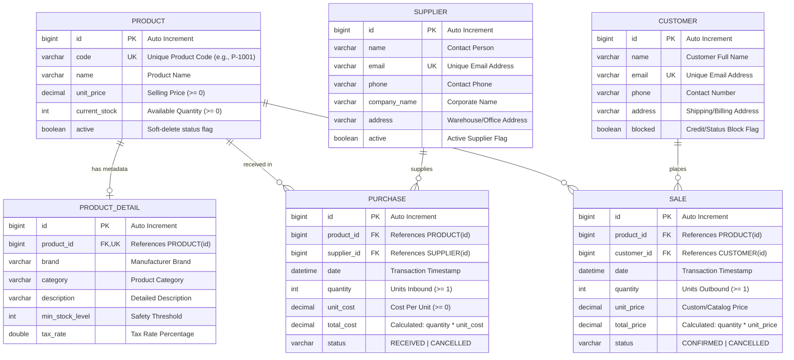
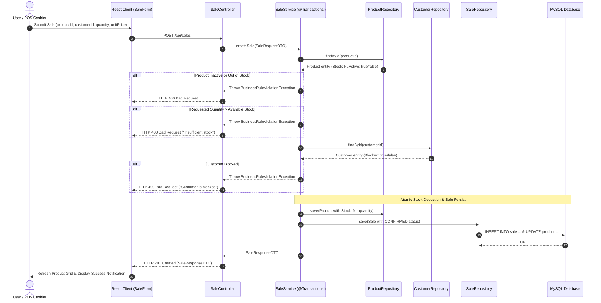
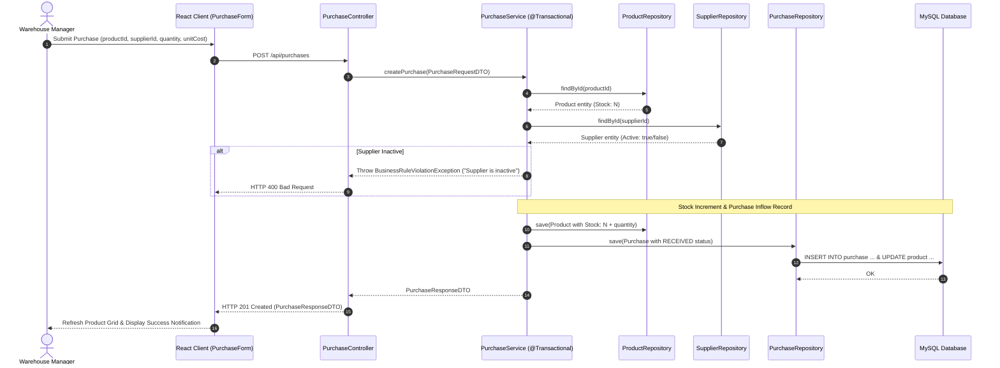

# System Architecture: Sale & Inventory Management System

This document outlines the architectural blueprint, structural diagrams, relational schema, and transaction execution flows for the **Sale & Inventory Management System**.

---

## 1. System Overview & Tier Architecture

The system is organized as a decoupled multi-tier enterprise web application adhering to clean layered architectural principles.



---

## 2. Relational Entity-Relationship (ER) Diagram

The persistence schema consists of 6 normalized relational tables with enforced foreign key constraints, column validations, and cascade rules.



---

## 3. Transactional Execution Flows

### A. Sales Order Processing (`SaleService.createSale`)

The sales workflow ensures strict atomicity and validates all domain invariants before decrementing inventory:



---

### B. Purchase Order Fulfillment (`PurchaseService.createPurchase`)



---

## 4. Query Optimization & Performance Design

To prevent the **N+1 Query Problem** inherent in relational ORM mappings when retrieving collections with associated lazy-loaded entities (`Purchase` -> `Product`, `Supplier`; `Sale` -> `Product`, `Customer`), custom repository methods employ explicit JPQL `JOIN FETCH` queries:

```java
@Query("""
    SELECT s FROM Sale s 
    JOIN FETCH s.product 
    JOIN FETCH s.customer 
    ORDER BY s.date DESC
""")
List<Sale> findAllWithDetails();
```

This single-query fetch strategy reduces database round trips from `1 + 2N` to exactly `1` query per list invocation, keeping latency minimal even under high record volume.
