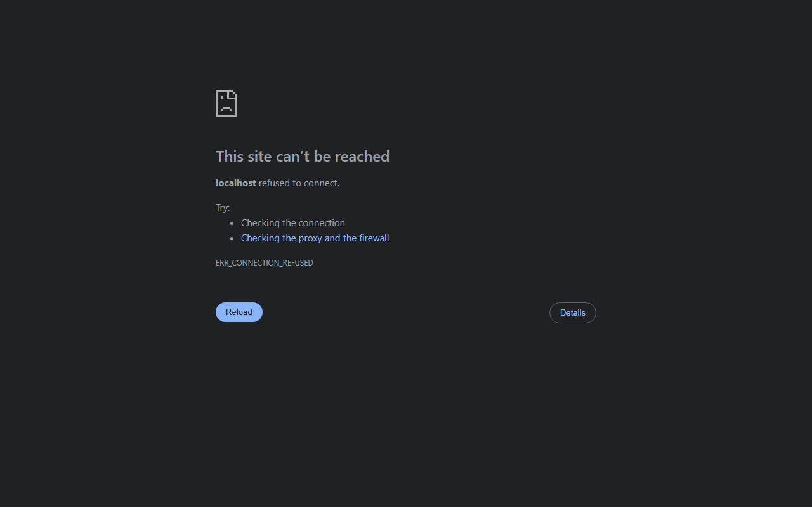
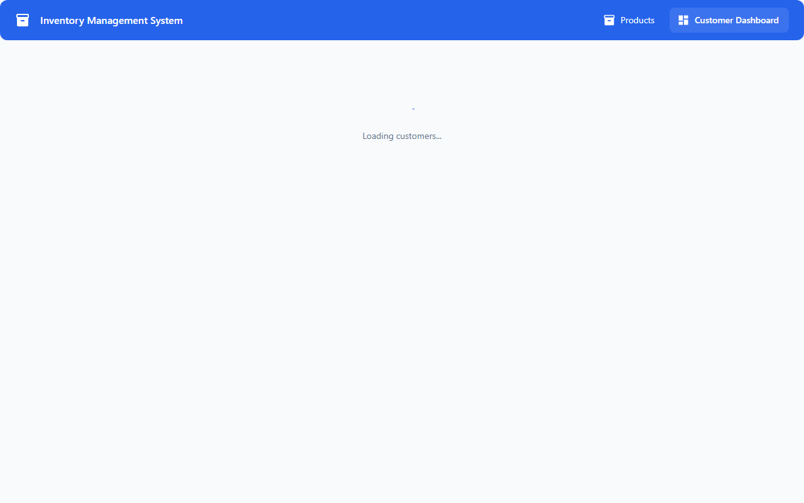

# User & Operations Guide

This guide details operational workflows, user interactions, and business rules implemented across the **Sale & Inventory Management System**.

---

## 1. Navigational Layout

The application navigation bar provides instant access to the core operational modules:

- **Products (`/products`):** Catalog management, stock monitoring, instant keyword search, and point-of-sale / replenishment actions.
- **Customer Dashboard (`/dashboard`):** Customer transaction history, status filtering, order cancellation review, and revenue analytics.

---

## 2. Product Inventory Management (`/products`)



### Key Capabilities:
1. **Live Keyword Search:** Instant multi-field filtering across product name, SKU code, and category.
2. **Low-Stock Visual Indicators:** Products with stock at or below their configured threshold display a warning badge.
3. **Data Sorting & Pagination:** Column sorting by price, quantity, or name powered by DataGrid.

---

## 3. Point-of-Sale Checkout Workflow (`Sell`)

When executing an outbound customer order:

```
[ Click "Sell" ]
       │
       ▼
[ Sale Modal Dialog Opens ]
       │
       ├─► 1. Select Customer from active customer dropdown
       ├─► 2. Enter Quantity (Validated: 1 <= Qty <= Current Stock)
       ├─► 3. Unit Price defaults to catalog price (Adjustable for discounts)
       ├─► 4. Real-time Total Price preview ($) calculated
       │
       ▼
[ Submit Order ]
       │
       ├─► Backend validates stock sufficiency and customer credit status
       ├─► Stock decremented atomically (@Transactional)
       └─► Success notification displayed & table refreshed
```

### Business Rules Enforced:
- **Quantity Validation:** Must be at least `1` and cannot exceed available `currentStock`.
- **Account Block Validation:** Sales to customers with `blocked = true` are rejected with HTTP 400.
- **Discontinued Item Guard:** Inactive products cannot be sold.

---

## 4. Supplier Replenishment Workflow (`Buy`)

When receiving inbound stock from a supplier:

```
[ Click "Buy" ]
       │
       ▼
[ Purchase Modal Dialog Opens ]
       │
       ├─► 1. Select Active Supplier from dropdown
       ├─► 2. Enter Inbound Quantity (>= 1)
       ├─► 3. Enter Supplier Unit Cost ($)
       ├─► 4. Real-time Total Cost & Projected Stock Level displayed
       │
       ▼
[ Confirm Purchase ]
       │
       ├─► Backend verifies supplier active status
       ├─► Product stock incremented atomically
       └─► Ledger record created with status RECEIVED
```

---

## 5. Customer Sales Dashboard (`/dashboard`)

The Customer Dashboard provides business intelligence and customer purchase histories.



### Metrics Computed:
- **Total Sales:** Count of all customer transactions regardless of status.
- **Confirmed Sales:** Count of completed, non-cancelled orders.
- **Total Revenue:** Sum of `totalPrice` across all confirmed customer transactions.
